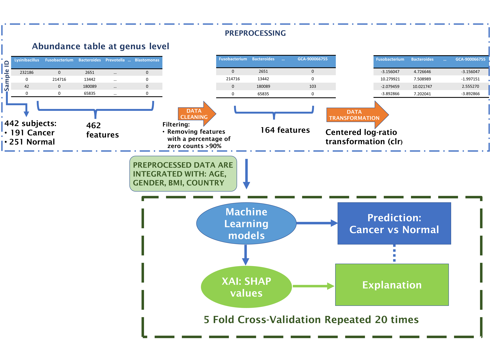

# XAI-for-Microbiome-Data-Analysis-in-CRC

## Paper: 
Explainable Artificial Intelligence for
Microbiome Data Analysis in Colorectal
Cancer Biomarker Identification
## Authors: 
Pierfrancesco Novielli, Donato Romano, Michele Magarelli, Pierpaolo Di
Bitonto, Domenico Diacono, Annalisa Chiatante, Giuseppe Lopalco,
Daniele Sabella, Vincenzo Venerito, Pasquale Filannino, Roberto Bellotti,
Maria De Angelis, Florenzo Iannone, Sabina Tangaro
## Overview of the analysis:

# Software Requirements
The provided codes have been tested on the following system:

Windows 11

Software versions used:

    Python: 3.11.5
    R: 4.3.2

In order to do the Centered Log-Ratio Transformation, scikit-bio package was used. This package is not available in the Windows environment. Therefore, a Linux machine was used only to perform this step of the analysis and create the normalized dataset.

Software version used in the Linux environment:

    Python: 3.8.10

# Installation Guide
In Python:

    pip install pandas
    pip install numpy
    pip install scipy
    pip install matplotlib
    pip install seaborn
    pip install xgboost
    pip install shap
    pip install scikit-learn
    pip install scikit-bio
    pip install statannot
    
In R-studio:

    install.packages("stats")
    

## Version Numbers for Python Packages in the Windows environment

    * pandas: 2.0.3
    * numpy: 1.24.3
    * scipy: 1.11.1
    * matplotlib: 3.7.2
    * seaborn: 0.12.2
    * xgboost: 2.0.2
    * shap: 0.43.0
    * scikit-learn: 1.3.0
    *statnnot: 0.2.3
    
## Version Numbers for R Packages in the Windows environment

    *stats: 4.3.2
    
## Version Numbers for Python Packages in the Linux environment

    * pandas: 1.5.3
    * numpy: 1.22.2
    * scikit-bio: 0.5.9
    

